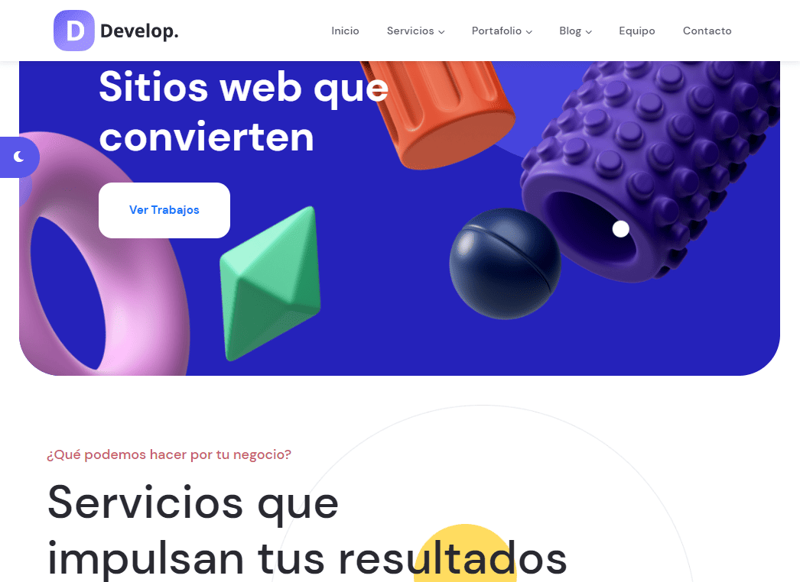
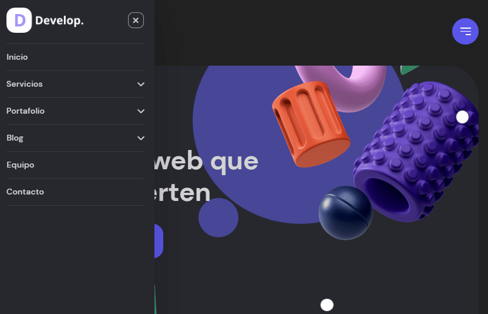

# Agency Landing Page

Responsive one-page site with an accessible off-canvas mobile menu, sticky navbar, and on-demand dark mode. Built with semantic HTML, **BEM-based CSS**, and modular vanilla JS (deferred scripts) with a strong focus on **accessibility** and **Core Web Vitals**.

  
  
  
  
  
  
  

---

## Table of Contents

- [Overview](#overview)
- [Features](#features)
- [Accessibility](#accessibility)
- [Performance & Metrics](#performance--metrics)
- [How to Verify the Metrics](#how-to-verify-the-metrics)
- [Tech Stack](#tech-stack)
- [Project Structure](#project-structure)
- [Getting Started](#getting-started)
- [Usage Notes](#usage-notes)
- [SEO](#seo)
- [Screenshots](#screenshots)
- [Roadmap](#roadmap)
- [License](#license)
- [Author](#author)

---

## Overview

Modern, lightweight landing page for a digital agency. The layout is **mobile-first**, uses a scalable **BEM** architecture with CSS custom properties, and follows best practices to keep **CLS** near 0 and deliver fast paints and interactions.

---

## Features

- **Accessible off-canvas menu** (focus is trapped inside the panel while open; `Escape` and overlay click close it).
- **Sticky navbar** that adds elevation on scroll for clarity.
- **Dark mode** via `prefers-color-scheme` plus a manual toggle persisted in `localStorage`.
- **Lazy-loaded images** (`loading="lazy"`) and animations designed to avoid layout thrashing.
- **Semantic structure** (`header`, `main`, `footer`) with clear section landmarks and a single `h1`.

---

## Accessibility

- Keyboard-friendly navigation (logical **Tab** order, `:focus-visible` styles).
- ARIA attributes (`aria-expanded`, `aria-controls`) synchronized with the mobile menu toggle state.
- Color contrast aims at **WCAG 2.1 AA** for primary content.
- Descriptive `alt` text on meaningful imagery; decorative assets are ignored by assistive tech.
- _Note:_ Heading levels are **mostly** consistent; some sections (e.g., stats/footer) still use visual `h*` sizes that will be normalized in the roadmap.

<strong>Quick a11y checklist I use</strong>

- Run **Lighthouse → Accessibility** in Chrome DevTools.
- Scan with **axe DevTools** or **Accessibility Insights**.
- Navigate only with keyboard (Tab / Shift+Tab / Enter / Escape) to confirm focus order and visibility.
- Zoom to **200%** and re-check contrast and layout.

---

## Performance & Metrics

**Last verified with Chrome Lighthouse (Mobile, throttled, Incognito).** Values vary by hardware/network.

### Lab results (mobile)

| Metric                  |                                                       Value |
| :---------------------- | ----------------------------------------------------------: |
| **FCP**                 |                                                 ~ **1.1 s** |
| **LCP**                 |                                                 ~ **2.9 s** |
| **TTI**                 |                                                 ~ **1.1 s** |
| **TBT**                 |                                                    **0 ms** |
| **CLS**                 |                                                  ~ **0.01** |
| **Lighthouse (mobile)** | **95 / 95 / 96 / 100** (Perf / A11y / Best Practices / SEO) |

### Lab results (desktop)

| Metric                   |                    Value |
| :----------------------- | -----------------------: |
| **Lighthouse (desktop)** | **100 / 95 / 100 / 100** |

**Optimizations implemented**

- Defer non-critical JS and avoid layout thrashing patterns.
- Compressed/optimized images; many specify `aspect-ratio`/dimensions to prevent CLS.
- Respect `prefers-reduced-motion` for users who prefer less animation.
- Static hosting with CDN caching (Netlify or similar).

---

## How to Verify the Metrics

1. **Open Chrome DevTools → Lighthouse**
   - Mode: **Mobile** · Categories: Performance, Accessibility, Best Practices, SEO
   - Options: **Simulated throttling**, **Incognito window**, **Clear storage** (Application tab → _Clear site data_).
2. **Network & CPU throttling**
   - Network: **Fast 3G or 4G**
   - CPU: **4× slowdown**
3. **Measure Core Web Vitals**
   - **LCP**: Performance panel → Web Vitals lane → Largest Contentful Paint.
   - **INP**: Lighthouse lab doesn’t report INP directly; use **TBT** as a lab proxy and validate INP with field data when available.
   - **CLS**: Performance panel → Experience → Cumulative Layout Shift.
4. _(Optional)_ **PageSpeed Insights** for field data if the page receives sufficient traffic.

If your results differ, review the [Roadmap](#roadmap) and disable browser extensions/ad blockers during testing.

---

## Tech Stack

- **HTML5**
- **CSS3** (BEM, CSS custom properties)
- **JavaScript** (vanilla, deferred script tags)
- Deploy-ready for **Netlify** / **Vercel** / any static host

---

## Project Structure

    ├─ assets/
    │  ├─ css/
    │  │  ├─ reset.css
    │  │  ├─ styles.css
    │  │  ├─ dark.css
    │  │  └─ responsive.css
    │  ├─ fonts/
    │  ├─ img/
    │  └─ js/
    │     ├─ dark.js
    │     ├─ menu-mobile.js
    │     └─ navbar-fixed.js
    └─ index.html

---

## Getting Started

### 1) Clone

    git clone https://github.com/zpymis/develop-site
    cd develop-site

### 2) Run locally

**Option A:** Open `index.html` directly in your browser.

**Option B (recommended):** Serve with a static server to emulate headers:

    # Node
    npx serve .

    # Python
    python -m http.server 5173

No build step needed — it’s a static site.

---

## Usage Notes

### Dark Mode

- Auto-detects OS preference via `prefers-color-scheme`.
- Manual toggle persists in `localStorage` (key: `theme`).

### Off-Canvas Menu

- Focus is trapped within the panel while open; overlay click or `Esc` closes it.
- `aria-expanded` on the toggle button; `aria-controls` targets the panel.
- Body scroll is locked when the menu is open.

---

## SEO

- Single `h1` per page; **mostly** consistent heading hierarchy (see Roadmap for minor normalizations).
- Essential meta tags: description, canonical URL.
- Open Graph & Twitter Card tags for rich link previews.
- In production, consider adding `sitemap.xml` and `robots.txt`.

---

## Screenshots

  

  

---

## Roadmap

- Normalize `h*` levels in stats/footer to keep a strict heading sequence.
- Remove/adjust any stray ARIA roles (e.g., `role="listitem"` outside of `ul/ol/[role=list]`).
- Add missing `width`/`height` (o `sizes/srcset`) to images that don’t have them yet to reduce bytes and avoid CLS in more cases.
- Add a high-contrast theme variant.
- Preload critical fonts and set `font-display: swap`.
- Convert raster images to WebP/AVIF where appropriate.
- Consider `<link rel="preload">` for the hero media if it becomes the LCP element.

---

## License

MIT — see [LICENSE](./LICENSE) for details.

---

## Author

**Missael Rangel** — Frontend Developer (React/TypeScript)  
🔗 [missaelr.com/en](https://missaelr.com/en) · [LinkedIn](https://www.linkedin.com/in/missaelrangel) · [GitHub](https://github.com/zpymis)
